# NOLINE

NOLINE은 네트워크가 없어도 여행 일정과 경비를 완벽하게 관리할 수 있는 **Local-First 여행 관리 앱**입니다.
오프라인 환경에서도 일정 추가, 경비 기록, 지도 확인이 가능하며, 네트워크 복구 시 자동으로 서버와 동기화됩니다.

> **"네트워크가 없어도 여행은 계속된다"**

<br>
<br>

# 📖 목차

- [🔥 Motivation](#-motivation)
- [📱 Preview & Features](#-preview--features)
- [⚙️ Tech Stack](#️-tech-stack)
- [📁 Project Structure](#-project-structure)
- [🚀 Quick Start](#-quick-start)
- [🏗️ Architecture](#-architecture)
  - [1. Echo Protocol: 오프라인에서도 ID를 생성하려면?](#1-echo-protocol-오프라인에서도-id를-생성하려면)
  - [2. Selective Activation: 모든 여행을 로컬에 저장하면 용량이 부족하다](#2-selective-activation-모든-여행을-로컬에-저장하면-용량이-부족하다)
  - [3. Policy Layer: 활성화하면 온라인에서도 구글맵을 못 쓴다?](#3-policy-layer-활성화하면-온라인에서도-구글맵을-못-쓴다)
- [🎨 User Experience](#-user-experience)
  - [1. Graceful Degradation: 오프라인에서 일정 추가를 완전히 막아야 할까?](#1-graceful-degradation-오프라인에서-일정-추가를-완전히-막아야-할까)
  - [2. PolicyErrorDisplay: 기능 제한을 어떻게 안내할까?](#2-policyerrordisplay-기능-제한을-어떻게-안내할까)
- [⚡ Optimization](#-optimization)
  - [1. 오프라인 경로 데이터 85% 압축](#1-오프라인-경로-데이터-85-압축)
  - [2. 오프라인 지도 선택적 다운로드](#2-오프라인-지도-선택적-다운로드)
- [🔫 Trouble Shooting](#-trouble-shooting)
  - [1. 데이터가 서버에 동기화되지 않는다?](#1-데이터가-서버에-동기화되지-않는다)
  - [2. 여행 비활성화 시 데이터가 손실된다](#2-여행-비활성화-시-데이터가-손실된다)
- [📜 Service Policies](#-service-policies)

<br>
<br>

# 🔥 Motivation

해외 여행 중 가장 불편한 순간은 바로 **네트워크가 불안정할 때**입니다.

비행기 안에서, 로밍이 안 되는 지역에서, 데이터가 끊긴 지하철에서 - 이런 순간에도 여행 일정을 확인하고, 경비를 기록하고, 지도를 봐야 할 때가 있습니다.

기존 여행 앱들은 대부분 **서버 의존적**입니다. 네트워크가 없으면 아무것도 할 수 없어, 이 문제를 해결하기 위해 **Local-First** 아키텍처를 선택했습니다.

1. **오프라인이 기본, 온라인은 보너스**: 네트워크 없이도 모든 핵심 기능이 작동해야 합니다.
2. **데이터 손실 제로**: 오프라인에서 입력한 데이터는 반드시 서버에 동기화되어야 합니다.
3. **사용자 경험 우선**: 네트워크 상태에 따라 앱이 버벅거리면 안 됩니다.

이 세 가지 목표를 달성하기 위해, 동기화 시스템 설계, 충돌 해결 전략, 저장공간 최적화 등 다양한 기술적 챌린지를 해결했습니다.

<br>
<br>

# 📱 Preview & Features

## 📍 여행 활성화 시스템

<div align="center">
  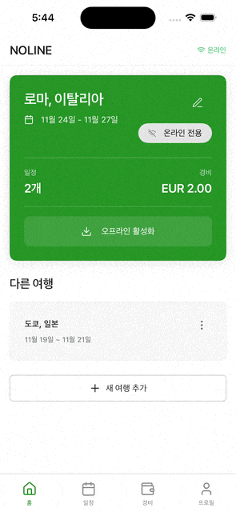
  <p><em>여행 카드 → 활성화 버튼 탭 → 다운로드 진행률 → "오프라인 준비 완료" 배지</em></p>
</div>

- 여행 생성/수정/삭제 (CRUD)
- **선택적 활성화**: 오프라인 사용할 여행 선택 (동시에 1개만)
- 활성화 시 오프라인 지도 + 경로 자동 다운로드
- 여행 종료 후 7일 경과 시 자동 비활성화

## 📅 일정 관리 + 오프라인 지도

<div align="center">
  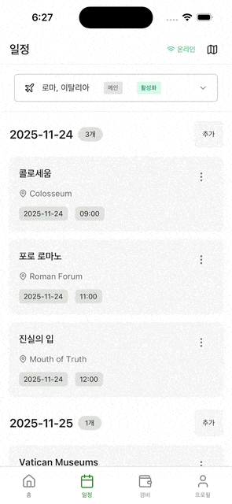
  <p><em>일정 리스트 → 지도 뷰 전환 → 개발 도구로 오프라인 전환 → 지도 정상 표시</em></p>
</div>

- 날짜/시간/장소 기반 일정 추가
- **지도 뷰 / 리스트 뷰** 전환: 온라인(Google Maps + 경로 탐색), 오프라인(Mapbox + 3가지 경로 표시)
- 오프라인에서도 수동 입력 가능 단, 온라인에서 지도 정보를 추가할 수 있음

## 💰 경비 관리

<div align="center">
  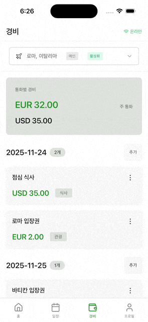
  <p><em>경비 입력 → 카테고리/통화 선택 → 날짜별 그룹화 + 다중 통화 합계</em></p>
</div>

- **다중 통화 지원**: KRW, USD, EUR, JPY 등
- 8가지 카테고리: 식비, 교통, 숙박, 액티비티, 쇼핑, 의료, 통신, 기타
- 날짜별 그룹화 및 자동 합계
- 오프라인에서도 수동 입력 가능

## 🔄 오프라인 동기화

<div align="center">
  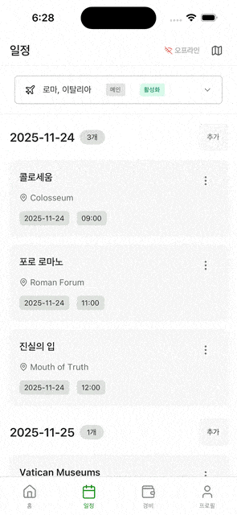
  <p><em>오프라인에서 일정 추가 → sync_queue 및 로컬 DB 저장</em></p>
</div>
<div align="center">
  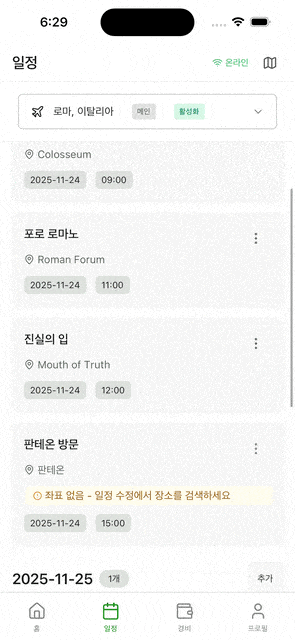
  <p><em>개발 도구로 네트워크 복구 → 자동 동기화 → 위치 정보 보강</em></p>
</div>

- **Outbox 패턴**: sync_queue 테이블로 안정적 동기화
- **Last-Write-Wins**: 충돌 해결 전략
- **경로 데이터 저장**: Polyline6 압축 (85% 용량 절감)
- **3-Profile 전략**: 도보/자전거/자동차 경로 동시 저장

<br>
<br>

# ⚙️ Tech Stack

### Frontend (React Native + Expo)

- **React Native** 0.74.5 + **Expo SDK 51**
- **TypeScript** 5.5
- **React Query** (서버 상태 관리)
- **Zustand** (로컬 상태 관리)
- **Drizzle ORM** + **SQLite** (로컬 DB)
- **React Hook Form** + **Zod** (폼 검증)
- **Expo Router** (파일 기반 라우팅)
- **NativeWind** (Tailwind CSS for RN)
- **Mapbox GL** (오프라인 지도)

### Backend (Node.js + Express)

- **Express** 4.18
- **TypeScript** 5.5 (ESM)
- **Drizzle ORM** + **PostgreSQL** (Neon)
- **Zod** (스키마 검증)
- **Google Maps Services** (Geocoding, Directions)

### Shared Packages (Monorepo)

- **@repo/schema**: Zod 스키마 (Single Source of Truth)
- **@repo/ui**: shadcn/ui 기반 컴포넌트 라이브러리
- **pnpm workspaces**: 모노레포 관리

<br>

# 📁 Project Structure

```
noline/
├── apps/
│   ├── client/                         # React Native (Expo) 앱
│   │   ├── app/                        # Expo Router 페이지 (파일 기반 라우팅)
│   │   └── src/
│   │       ├── entities/               # 도메인 엔티티 (FSD Architecture)
│   │       │   ├── trip/               # 여행
│   │       │   │   ├── api/            # 서버 API 호출
│   │       │   │   ├── data/           # React Query hooks
│   │       │   │   ├── lib/            # 로컬 DB 접근
│   │       │   │   ├── model/          # 타입 정의
│   │       │   │   ├── repository/     # Router 패턴 (Local/Remote 분기)
│   │       │   │   └── ui/             # UI 컴포넌트
│   │       │   ├── schedule/           # 일정 (동일 구조)
│   │       │   └── expense/            # 경비 (동일 구조)
│   │       ├── features/               # 기능 단위 모듈
│   │       │   ├── trip/               # 여행 생성/수정
│   │       │   ├── schedule/           # 일정 CRUD + 지도뷰
│   │       │   └── expense/            # 경비 CRUD
│   │       └── shared/                 # 공유 모듈
│   │           ├── db/                 # SQLite + Drizzle 설정
│   │           ├── services/
│   │           │   ├── offline-prep/   # 🔥 Router (활성화 상태별 분기)
│   │           │   ├── sync/           # sync_queue 관리
│   │           │   └── offline-map/    # Mapbox 오프라인 지도
│   │           ├── policy/             # Policy Layer (4-State Matrix)
│   │           └── lib/                # 유틸리티 (datetime, currency)
│   │
│   └── server/                         # Express API 서버
│       └── src/
│           ├── routes/                 # API 엔드포인트
│           ├── db/                     # PostgreSQL + Drizzle
│           └── middleware/             # 인증, 에러 핸들링
│
└── packages/
    ├── schema/                         # 🔥 공유 Zod 스키마 (Source of Truth)
    │   └── src/
    │       ├── entities/               # 도메인 모델 스키마
    │       ├── requests/               # API 요청 스키마
    │       ├── responses/              # API 응답 스키마
    │       └── sync/                   # 동기화 관련 스키마
    └── ui/                             # 공유 UI 컴포넌트
```

<br>
<br>

# 🚀 Quick Start

```bash
# 의존성 설치
pnpm install

# schema 빌드
pnpm --filter @repo/schema build

# 서버 실행 (Docker PostgreSQL 필요)
cd apps/server
docker-compose up -d
pnpm dev

# 클라이언트 실행 (새 터미널에서)
cd apps/client
pnpm run ios
```

> **📖 상세 설정 가이드**: 환경 변수, API 키 발급, 트러블슈팅 등 자세한 내용은 [START_GUIDE.md](./START_GUIDE.md)를 참조하세요.

# 🏗 Architecture

NOLINE의 아키텍처는 3개의 레이어로 구성됩니다. 각 레이어는 이전 문제를 해결하면서 점진적으로 진화했습니다.

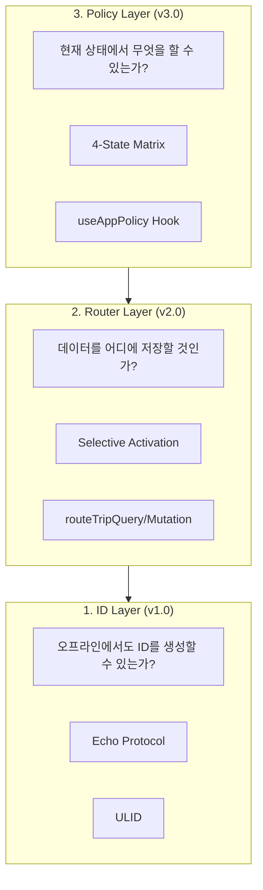

<br>

## 1. Echo Protocol: 오프라인에서도 ID를 생성하려면?

오프라인에서 데이터를 생성하려면 가장 먼저 해결해야 할 문제가 있습니다. 바로 **ID 생성**입니다.

일반적인 앱에서는 서버가 ID를 생성합니다. 하지만 오프라인 환경에서는 서버에 접근할 수 없으므로, 클라이언트가 직접 ID를 생성해야 합니다.

### 고민: 여러 기기에서 ID가 충돌하면?

클라이언트가 ID를 생성하면 **충돌 위험**이 있습니다. 두 기기에서 동시에 같은 ID를 생성하면 데이터가 덮어씌워지는 문제가 발생합니다.

### 해결: ULID + Echo Protocol

**ULID(Universally Unique Lexicographically Sortable Identifier)**를 도입했습니다:

- **시간순 정렬**: 생성 시간이 ID에 포함되어 정렬이 자연스럽습니다.
- **충돌 방지**: 밀리초 단위 타임스탬프 + 랜덤 값으로 사실상 충돌 불가능합니다.
- **UUID 호환**: 기존 시스템과의 호환성이 좋습니다.

**Echo Protocol**: 클라이언트가 생성한 ID를 서버가 그대로 수용합니다.

```typescript
import { generateId } from '@/shared/services/id/ulid';

const createTrip = async (data: CreateTripRequest) => {
  const id = generateId(); // 클라이언트에서 ULID 생성

  await routeTripMutation({
    local: () =>
      withTransaction(async () => {
        await db.insert(trips).values({ id, ...data });
        await addToSyncQueue('trips', id, 'CREATE', data);
      }),
    remote: () => api.post('/trips', { id, ...data }), // 서버는 클라이언트 ID 수용
  });
};
```

<br>

## 2. Selective Activation: 모든 여행을 로컬에 저장하면 용량이 부족하다

처음에는 "모든 데이터를 로컬에 저장하면 되지 않나?"라고 생각했습니다.

### 고민: 오프라인 지도 용량 문제

하지만 오프라인 지도까지 고려하면 이야기가 달라집니다. **한 도시의 오프라인 지도는 약 60~200MB**입니다.
10개의 여행을 저장하면 최대 2GB가 필요합니다. 물론 모바일 기기에서 감당할 수 있지만, 서버처럼 통제가 가능하지 못한 로컬환경에 데이터를 무작정 저장하는 것은 문제가 있다고 생각했습니다.

### 검토한 대안들

이 문제를 해결하기 위해 4가지 대안을 검토했습니다:

| 대안                            | 장점                        | 단점                                | 결정    |
| ------------------------------- | --------------------------- | ----------------------------------- | ------- |
| **A. sync_queue만 제어**        | 기존 아키텍처 유지          | 저장 공간 문제 해결 안 됨           | ❌ 폐기 |
| **B. temp_cache + Merge 로직**  | 비활성 여행도 오프라인 편집 | 엣지케이스 21개, 복잡도 과도        | ❌ 폐기 |
| **C. 여행 개수 제한 (10~20개)** | 구현 단순                   | 강제 삭제 UX 나쁨, 사용자 제어 없음 | ❌ 폐기 |
| **D. 선택적 활성화 (1개 제한)** | 명확한 UX, 복잡도 50% 감소  | 비활성 여행 오프라인 편집 불가      | ✅ 채택 |

처음에는 **B안(temp_cache)**을 진지하게 검토했습니다. 비활성화된 여행도 오프라인에서 편집할 수 있도록 임시 캐시와 Merge 로직을 설계했습니다. 하지만 구현하다 보니 엣지케이스가 21개나 나왔고, TTL 관리, 버전 충돌 해결, Read-After-Write 일관성 등 복잡도가 너무 높았습니다.

결국 "**활성화 = 오프라인 보험, 비활성 = 온라인 전용**"이라는 단순한 정책을 선택했습니다. 복잡도가 50% 감소했습이다.(엣지케이스 21개 → 9개)

### 해결: 선택적 활성화 (Selective Activation)

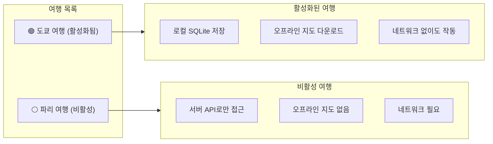

### 구현: Router 패턴으로 자동 분기

활성화 상태에 따라 로컬/서버를 분기하는 **Router 패턴**을 도입했습니다:

```typescript
// ❌ Bad: 모든 곳에서 if문으로 분기
const getTrips = async () => {
  const isActivated = await checkActivation(tripId);
  if (isActivated) {
    return await db.select().from(trips);
  } else {
    return await api.get('/trips');
  }
};

// ✅ Good: Router가 분기 로직을 캡슐화
const getTrips = async () => {
  return await routeTripQuery({
    local: () => db.select().from(trips),
    remote: () => api.get('/trips'),
  });
};
```

Router 패턴의 장점:

- **단일 책임**: 분기 로직은 Router에만 존재합니다.
- **일관성**: 모든 데이터 접근이 동일한 패턴을 따릅니다.
- **테스트 용이**: Router만 모킹하면 Local/Remote 테스트가 쉽습니다.

### 트레이드오프

이 결정으로 **비활성화된 여행은 오프라인에서 편집할 수 없습니다**. 하지만 실제 사용 패턴을 생각해보면, 여행 중에는 해당 여행이 활성화되어 있을 것이고, 비활성 여행을 편집하는 상황은 대부분 온라인일 것입니다. 이 트레이드오프를 수용하기로 했습니다.

<br>

## 3. Policy Layer: 활성화하면 온라인에서도 구글맵을 못 쓴다?

Router 패턴을 구현하고 나니 예상치 못한 문제가 생겼습니다.

### 고민: "오프라인 대비"가 "온라인 기능 제한"이 되어버림

여행을 **활성화**하면 "모든 것이 로컬"이 됩니다. 그래서 **온라인 상태에서도** 구글맵 대신 오프라인 맵만 사용할 수 있었습니다:

```
활성화된 여행 (온라인 상태)
├── 일정 데이터: 로컬 SQLite ✅
├── 지도: 오프라인 Mapbox만 ❌ (구글맵 못 씀!)
└── 장소 검색: 비활성화 ❌ (API 호출 안 함!)
```

### 원인 분석: 데이터와 서비스는 다르다

문제의 핵심은 **모든 것에 같은 정책을 적용**했다는 점입니다:

|    구분    |          예시           | 특징                          |
| :--------: | :---------------------: | :---------------------------- |
| **데이터** | Trip, Schedule, Expense | 소유권 있음, 동기화 필요      |
| **서비스** | Map, Search, Directions | 소유권 없음, 최신 정보가 중요 |

일정 데이터는 오프라인에서 수정해도 나중에 동기화하면 됩니다. 하지만 지도나 검색은 **가능하면 최신 정보**를 사용하는 게 좋습니다.

### 해결: Data/Service 분리 + Policy Layer

두 레이어를 분리하고, **Policy Layer**로 중앙 제어하기로 했습니다:

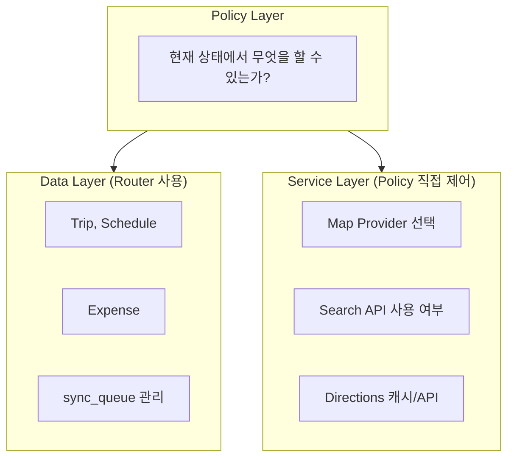

**네트워크 상태**와 **활성화 상태**를 조합한 **4-State Matrix**:

|        상태        | 지도 제공자 | 장소 검색 | 일정 생성 |
| :----------------: | :---------: | :-------: | :-------: |
|  `online_active`   |   Google    |    API    |   가능    |
| `online_inactive`  |   Google    |    API    |   가능    |
|  `offline_active`  |   Mapbox    |   불가    | 수동 입력 |
| `offline_inactive` |    없음     |   불가    |   불가    |

```typescript
// useAppPolicy Hook으로 정책 조회
const policy = useAppPolicy(tripId);

switch (policy.service.mapProvider) {
  case 'google':
    return <GoogleMapView />;
  case 'mapbox':
    return <OfflineMapView />;
  case 'none':
    return <NoMapAvailable reason="여행을 활성화해주세요" />;
}
```

이제 **온라인 + 활성화** 상태에서도 구글맵을 사용할 수 있습니다!

<br>
<br>

# 🎨 User Experience

Policy Layer를 활용하여 **오프라인에서도 자연스러운 사용자 경험**을 제공합니다.

## 1. Graceful Degradation: 오프라인에서 일정 추가를 완전히 막아야 할까?

오프라인에서는 Google Places API를 사용할 수 없습니다.

### 고민: 완전 차단 vs 부분 허용

두 가지 선택지가 있었습니다:

| 선택지           | 장점                        | 단점                       |
| ---------------- | --------------------------- | -------------------------- |
| **A. 완전 차단** | 구현 간단, 데이터 품질 보장 | 오프라인에서 아무것도 못함 |
| **B. 부분 허용** | 핵심 기능 유지              | 불완전한 데이터 처리 필요  |

비행기 안에서 "내일 에펠탑 가야지"라고 메모하고 싶은 상황을 생각해보면, **완전 차단은 처음 의도와는 다르게 불편할거라 생각했습니다**.

### 해결: Graceful Degradation

> **"핵심 정보만 먼저, 부가 정보는 나중에"**

일정의 핵심은 **"언제 어디를 갈지 기록"**입니다. 정확한 좌표는 부가 정보입니다.

- **오프라인**: 제목, 메모, 날짜/시간 → 저장 가능
- **좌표, 상세 주소**: 온라인 복구 후 보강

### 구현: Manual Input + 재검색

**오프라인에서 저장**:

<div align="center">
  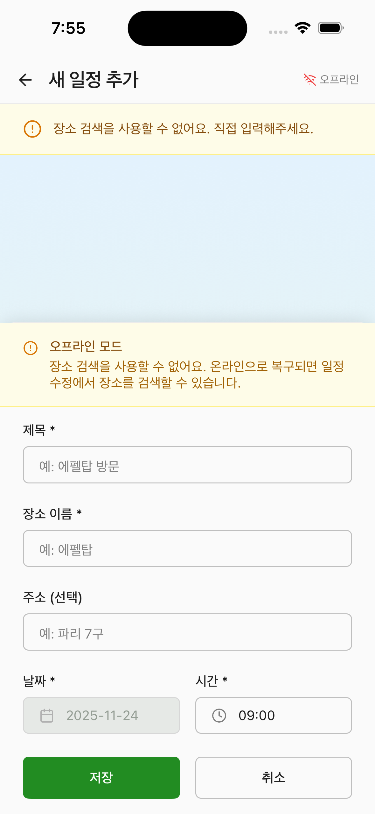
</div>

**온라인 복구 후 보강** - "장소 재검색" 버튼으로 좌표를 보완합니다:

<table align="center">
  <tr>
    <td>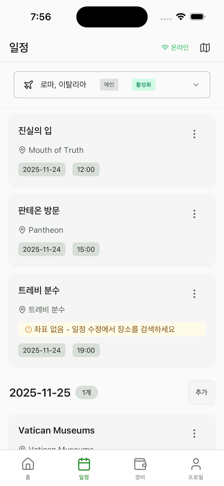</td>
    <td>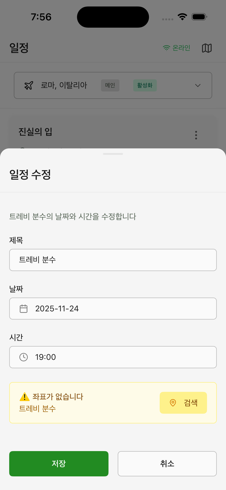</td>
  </tr>
</table>

<br>

## 2. PolicyErrorDisplay: 기능 제한을 어떻게 안내할까?

기능 제한이 있을 때 사용자에게 어떻게 알려줄까요?

### 고민: 모든 제한을 모달로?

처음에는 단순하게 생각했습니다. "제한이 있으면 모달 팝업 띄우면 되지."

하지만 제한의 종류가 다양합니다:

| 제한 유형     | 예시                   | 심각도                     |
| ------------- | ---------------------- | -------------------------- |
| **완전 차단** | 오프라인에서 여행 생성 | 높음 - 해당 기능 사용 불가 |
| **부분 제한** | 환율 정보 없이 저장    | 중간 - 기능은 사용 가능    |
| **일반 안내** | 현재 오프라인 상태     | 낮음 - 참고만              |

모든 상황에 모달을 띄우면 **사용자가 피로해집니다**. 반대로 작은 텍스트로만 안내하면 **중요한 제한을 놓칠 수 있습니다**.

### 해결: 심각도별 3가지 variant

> **"제한의 심각도에 따라 UI 강도를 조절"**

- **높음**: Block (전체 영역 차단) - 막아야 하는 것
- **중간**: Banner (상단 경고) - 알아야 하는 것
- **낮음**: Inline (텍스트 힌트) - 참고할 것

### 구현: NetworkStatusIndicator + PolicyErrorDisplay

**NetworkStatusIndicator** - 헤더에서 현재 상태 확인:

<div align="center">
  
</div>

**PolicyErrorDisplay** - 심각도별 3가지 패턴:

```typescript
// 1. Block: 전체 영역 차단 (높음 - 사용 불가)
<PolicyErrorDisplay variant="block" permission={policy.trip.create} />
// → 화면 전체를 덮어서 "여행 생성은 온라인에서만 가능합니다."

// 2. Banner: 페이지 상단 경고 (중간 - 알림)
<PolicyErrorDisplay variant="banner" permission={policy.schedule.create} />
// → 상단 배너로 "오프라인 상태입니다. 일부 기능이 제한됩니다."

// 3. Inline: 버튼 옆 작은 안내 (낮음 - 참고)
<PolicyErrorDisplay variant="inline" permission={policy.expense.create} />
// → 버튼 아래 텍스트로 "환율 정보 없이 저장됩니다"
```

이 패턴으로 **사용자 피로를 줄이면서도 중요한 정보는 확실히 전달**합니다.

<br>
<br>

# ⚡ Optimization

## 1. 오프라인 경로 데이터 85% 압축

오프라인에서도 일정 간 경로를 표시하려면 경로 데이터를 로컬에 저장해야 합니다. 문제는 경로 데이터의 크기입니다.

Google Maps Directions API가 반환하는 원본 좌표 배열은 **일정 2개당 약 50KB**입니다. 10개 일정이면 250KB, 여기에 3가지 이동수단(도보/자전거/자동차)을 저장하면 **750KB**가 됩니다.

### 검토한 포맷

| 포맷          | 크기/경로    | 특징                  | 결정    |
| ------------- | ------------ | --------------------- | ------- |
| **GeoJSON**   | ~2,400 bytes | 사람이 읽기 쉬움      | ❌ 폐기 |
| **Polyline6** | ~350 bytes   | Mapbox 표준, 85% 압축 | ✅ 채택 |

**Polyline6 인코딩**을 적용하여 이 문제를 해결했습니다:

```typescript
// ❌ Before: 원본 좌표 배열 (50KB)
const rawCoordinates = [
  { latitude: 35.6762, longitude: 139.6503 },
  { latitude: 35.6764, longitude: 139.6505 },
  // ... 수백 개의 좌표
];

// ✅ After: Polyline6 인코딩 (7KB)
const encoded = '_p~iF~ps|U_ulLnnqC_mqNvxq`@';

// 디코딩은 필요할 때만
import polyline from '@mapbox/polyline';
const decoded = polyline.decode(encoded, 6); // precision 6
```

**압축 원리**:

- 좌표를 문자열로 인코딩 (Base64 유사)
- 연속된 좌표 간의 차이값만 저장 (Delta Encoding)
- precision 6으로 소수점 6자리까지 정밀도 유지

**결과**:

- 50KB → 7KB (약 **85% 압축**)
- 3-Profile 전략: 도보/자전거/자동차 경로를 모두 저장해도 부담 없음
- SQLite TEXT 컬럼 하나에 저장 가능

<br>

## 2. 오프라인 지도 선택적 다운로드

Mapbox 오프라인 지도는 도시 하나당 **60~200MB**입니다. 모든 여행의 지도를 다운로드하면 저장공간이 금방 부족해집니다.

**선택적 활성화 + 참조 카운팅**으로 해결했습니다:

```typescript
// 오프라인 지도 메타데이터 (SQLite)
const offlineCities = {
  id: 'tokyo',
  bounds: { ne: [35.9, 140.0], sw: [35.5, 139.5] },
  referenceCount: 2, // 2개의 여행이 이 지도를 참조 중
  downloadedAt: '2024-03-15T10:00:00Z',
  sizeBytes: 150_000_000, // 150MB
};
```

**참조 카운팅 동작**:

1. 여행 A 활성화 → 도쿄 지도 다운로드, `referenceCount: 1`
2. 여행 B 활성화 (같은 도시) → 다운로드 스킵, `referenceCount: 2`
3. 여행 A 비활성화 → `referenceCount: 1` (지도 유지)
4. 여행 B 비활성화 → `referenceCount: 0` → 지도 삭제

**결과**:

- 같은 도시 중복 다운로드 방지
- 사용하지 않는 지도 자동 정리
- 저장공간 효율적 관리

<br>
<br>

# 🔫 Trouble Shooting

## 1. 데이터가 서버에 동기화되지 않는다?

가장 치명적인 버그였습니다. 오프라인에서 일정을 추가했는데, 온라인이 되어도 서버에 반영되지 않는 경우가 있었습니다.

원인을 분석해보니 **withTransaction 누락**이 문제였습니다:

```typescript
// ❌ Bad: DB와 sync_queue가 따로 실행됨
const createScheduleLocal = async (data) => {
  await db.insert(schedules).values(data); // 1. DB insert 성공
  await addToSyncQueue('schedules', data.id); // 2. sync_queue 실패!
  // 결과: 데이터는 로컬에 있지만 서버에 동기화되지 않음
};
```

DB insert는 성공했지만, sync_queue 추가가 실패하면 **영원히 동기화되지 않는 유령 데이터**가 생깁니다.

**withTransaction**으로 원자성을 보장하여 해결했습니다:

```typescript
// ✅ Good: 둘 다 성공하거나 둘 다 롤백
const createScheduleLocal = async (data) => {
  await withTransaction(async () => {
    await db.insert(schedules).values(data);
    await addToSyncQueue('schedules', data.id, 'CREATE', data);
  });
  // 하나라도 실패하면 전체 롤백
};
```

**교훈**: 로컬 DB 작업과 sync_queue 추가는 반드시 같은 트랜잭션에서 실행해야 합니다.

<br>

## 2. 여행 비활성화 시 데이터가 손실된다

여행을 비활성화하면 로컬 데이터를 삭제해야 합니다. 그런데 **sync_queue에 PENDING 작업이 남아있는 상태에서 삭제**하면 문제가 생깁니다:

```typescript
// ❌ Bad: sync_queue 확인 없이 즉시 삭제
const deactivateTrip = async (tripId: string) => {
  await db.update(tripActivations).set({ isActivated: false });
  await db.delete(schedules).where(eq(schedules.tripId, tripId)); // Hard delete!

  // 문제 시나리오:
  // 1. 오프라인에서 일정 생성 → sync_queue에 PENDING
  // 2. 비활성화 실행 → 로컬 데이터 삭제
  // 3. 온라인 복구 → sync engine이 동기화 시도
  // 4. ❌ 로컬에 데이터 없음 → 서버 전송 실패
  // 5. 결과: 데이터 영구 손실 💀
};
```

**3단계 삭제 시스템**을 구축하여 해결했습니다:

```typescript
// ✅ Good: 3단계 안전 삭제
const deactivateTrip = async (tripId: string) => {
  // Phase 1: sync_queue 체크
  const hasPending = await hasPendingTasksForTrip(tripId);

  await withTransaction(async () => {
    await db.update(tripActivations).set({
      isActivated: false,
      cleanupPending: hasPending, // PENDING 있으면 지연 플래그
    });

    // PENDING 없으면 즉시 Soft delete
    if (!hasPending) {
      await db.update(schedules).set({ deletedAt: new Date().toISOString() }).where(eq(schedules.tripId, tripId));
    }
  });

  // Phase 2: Background Job이 sync 완료 후 Soft delete 실행
  // Phase 3: 7일 후 Vacuum이 Hard delete 실행
};
```

핵심 포인트:

- **Soft Delete 우선**: `deletedAt` 필드 설정 (복구 가능)
- **cleanupPending 플래그**: sync 완료 대기
- **Background Job**: sync 완료 확인 후 cleanup 실행
- **7일 유예 기간**: 실수로 삭제해도 복구 가능

<br>
<br>

# 📜 Service Policies

프로젝트의 핵심 서비스 정책입니다.

### 오프라인 정책

- **오프라인이 기본**: 네트워크 없이도 핵심 기능 작동
- **데이터 손실 제로**: 오프라인 입력 → 반드시 서버 동기화
- **즉각 반응**: 서버 대기 없이 즉시 UI 반영

### 여행 활성화 정책

- **활성화 = 오프라인 보험**: 로컬 저장 + 오프라인 지도 다운로드
- **비활성 = 온라인 전용**: 저장공간 절약
- **동시 1개만**: 오프라인 지도 용량 문제 (60~200MB/여행)

### 기능 제한 정책

| 상태              | 여행 생성 | 일정/경비   | 지도   |
| ----------------- | --------- | ----------- | ------ |
| 온라인            | ✅        | ✅ Full     | Google |
| 오프라인 + 활성화 | ❌        | ✅ 수동입력 | Mapbox |
| 오프라인 + 비활성 | ❌        | ❌          | ❌     |

### Graceful Degradation

- **핵심 우선**: 오프라인에서 제목/날짜/금액 입력 가능
- **보강은 나중에**: 좌표/사진은 온라인 복구 후

### 통화 정책

- **환율 변환 없음**: 통화별 독립 관리
- **통화별 그룹핑**: EUR/USD/KRW 따로 합계

### 데이터 보호 정책

- **Soft Delete**: 삭제 후 7일간 복구 가능
- **Last-Write-Wins**: 충돌 시 최신 데이터 우선

<br>
<br>

---
