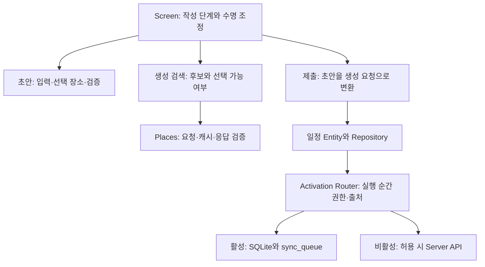

# 일정 생성 전체의 책임 분리와 검증·커밋 결정

## 이번 결과와 범위

스케줄 생성의 작성 연속성을 유지하는 기존 미커밋 구현에 Places 서비스 경계와 생성·수정 소비자의 계약 분리를 추가했다. 사용자는 2026-10-02 대화 기록과 커밋을 요청했다. 이전 커밋 보류는 이 요청으로 변경됐다. 제품 코드와 검증 결과를 보존하며, Ticket 06 전체 완료나 실환경 검증 완료로 확대하지 않는다.

비교 기준은 두 가지다. 스케줄 생성 전체의 전후는 브랜치 `refactor/app-startup-lifecycle`의 당시 HEAD `ee1c005`와 현재 작업물이다. 이번 Places 분리의 전후는 이미 단일 폼이 구현돼 있던 미커밋 상태와 분리 후 상태다. 후자의 성과를 전체 생성 개편 성과와 섞지 않는다. 이전 구현·철회·잠정 기준은 [앞선 기록](2026-10-01-01-schedule-create-provisional-review.md)에 보존한다.

## 사용자 의도와 검토 방향

사용자는 마지막에 발견된 날짜·지도 문제 두 건보다 문제 배경과 현재 구조를 면밀히 파악하라고 정정했다. 기능 해결에 접근했더라도 관심사 분리·아키텍처·코드 관점에서 확신하기 어렵다는 이유로, 통과 판정 위주의 검토 대신 전문가의 독립 리뷰와 더 나은 결과의 구체적 평가 기준을 요구했다.

이 대화의 결정·정정 근거인 최소 원문은 다음과 같다.

> “마지막 문제 2가지는 아직 그렇게 중요한건 아니고 일단 문제 배경이랑 잘 확인해봐 코드랑 면밀하게”
>
> “지금 결과물이 어쨋든 문제 해결에 대해서는 꽤 접근한건 맞아 근데 관심사 분리 아키텍쳐 코드 관점에서 뭔가 확신이 안들어서”
>
> “그리고 나은 결과를 위한 구체적 평가 기준도 제시히라고 해”
>
> “아니다 커밋 하지말고 그냥 진행해봐 그 다음 전 후 어떻게 바뀌었는지 도식화 해서 제대로 설명하고”
>
> “그러니까 이번 작업만 말고 우리가 해결하려던 스케줄 생성 이슈 시스템으로 해서 설명해봐”
>
> “그래 기록 워크스페이스에 대화 나온거 잘 남겨주고 커밋 해”

출처는 2026-10-01~02 이 Main 대화다. 앞의 보류는 구현·검토 단계의 지시였고 마지막 요청이 현재 커밋 권한이다. 시스템 설명 요청에 따라 Main은 마지막 Places 변경만 설명하던 범위를 생성 진입·초안·검색·지도·제출·실제 저장까지 넓혔다. 단순 파일 목록보다 각 코드의 근본 역할과 상태 수명을 설명하는 것이 사용자의 판단 목적이었다.

## 원래 결함과 현재의 정신 모델

이전에도 폼 값은 화면의 훅에 있었다. 핵심 결함은 값의 위치 하나가 아니라 네트워크 정책이 작성 화면의 형태까지 결정한 것이었다. `manual-only`에 수동 폼, 작성 단계와 선택 장소에 일반 폼이 별도로 매달려 온라인 복귀 시 수동 폼 숨김·단절 시 두 폼 동시 표시가 가능했다. 저장 불가 정책은 화면 전체를 가렸고, 장소 변경의 reset과 장소 감시 effect는 작성 내용·제목을 덮었다.

현재는 한 여행의 일정 작성 동안 세 책임을 구분한다. 사용자 단계는 검색/작성/장소 변경, 초안은 입력값과 채택한 장소, 외부 기능 상태는 검색·지도·저장 가용성과 비동기 결과다. 연결 변화는 기능의 가용성에 반영하고 작성 단계나 초안을 자동 초기화하지 않는다. 초안은 화면 안의 미저장 값이며 종료 후 복원 기능이 아니다.

아래는 현재 소스 연결을 설명한 도식이며 실기기 실행 trace가 아니다. 정책·지도 내부 상세는 생략했다.

검색 패널과 폼은 번갈아 표시되지만 초안·검색·제출 훅은 같은 Screen 아래에서 계속 유지된다. 폼 내부로 훅만 옮기면 장소 변경 때 수명이 끊기므로 현재 수명 구성을 유지했다. 여행 ID가 바뀌면 새 작성 상태를 만든다. 폼을 더 아래로 옮기거나 총괄 workflow 훅을 새로 만드는 것을 필수 개선으로 채택하지 않았다.

초안은 장소 선택의 의미를 소유한다. 장소명·주소·좌표를 채택하되 사용자가 고친 제목을 보존하고, 직접 장소 수정은 텍스트를 유지하면서 이전 좌표 연결을 해제한다. Screen은 장소 채택과 작성 단계 전환을 연결한다. UI 영역은 해당 제한·오류를 표현한다. 제출 훅은 ID·시각·좌표를 요청으로 변환하고 기존 Entity를 호출한다. Local/Remote를 화면에서 고르지 않는다.

## 독립 리뷰와 적용한 개선

프런트엔드 구조와 애플리케이션 경계를 맡은 두 독립 reviewer에게 원자료 접근점을 제공했다. Main은 보고를 종합해 현재 초안 수명을 유지하고 Places 결과 보장·공통 소유 위치·소비자 차이를 먼저 명확히 하는 방향을 선택했다. 저장 후 경로 준비는 별도 남겼다. worker가 구현했고 두 reviewer가 결과를 다시 검토했다. 이 보고는 사용자 최종 제품 수락을 대신하지 않는다.

구체적인 평가 기준은 파일 수나 훅 분할 여부가 아니라 다음 관계다.

| 평가 기준 | 확인할 질문과 현재 적용 |
| --- | --- |
| 상태 수명 | 검색을 오가거나 연결이 바뀌어도 같은 초안이 유지되는가? 조건부 UI 위의 소유를 유지했다. |
| 의미의 소유 | 제목 자동 입력·좌표 해제는 초안, 응답 검증은 서비스, 실제 쓰기는 Router가 결정하는가? |
| 타입의 보장 | 같은 타입이면 같은 유효성 보장을 주는가? 정상 상세 장소와 실패 호환값을 분리했다. |
| 표시와 채택 | 지도에 보이는 위치가 곧 선택 가능·초안 채택을 뜻하지 않도록 구분했는가? |
| 비동기 경계 | 요청 시작·완료·선택·저장의 정책과 실패가 초안 수명을 깨지 않는가? |
| 수정 부담 | 같은 검색 의미를 고칠 때 생성 feature를 수정 화면이 참조해야 했던 의존이 없어졌는가? |

공통 `shared/services/places`는 Zod 기반 검색·상세 응답 검증, 정책 검사와 Query를 소유한다. `ResolvedPlace`는 상세 검증을 통과한 장소이고 `PlaceResolution`은 성공/상세 실패를 구분한다. 생성은 정상 장소만 받고, 수정은 기존 상세 실패 시 0/0 동작을 update feature의 명시적인 compatibility adapter에 남겼다. 정상 위도 0과 실패 대체 0을 같은 보장으로 취급하지 않는다. 두 계약의 Query key도 분리했다.

공통 검색 UI는 표시와 선택 이벤트를 전달한다. 생성은 지도 표시용 결과와 지금 선택 가능한 결과를 나눈다. A를 초안에 채택한 채 B를 검색하면 지도는 B 후보를 보여주고, 명시적으로 B를 선택하기 전 초안은 A를 유지한다. 후보가 없으면 채택 장소를 지도에 전달한다. 이전 선택 장소가 새 후보를 가리던 연결은 이 변경으로 보완했고 props 연결 자동 검사를 추가했다.

새 상세 schema는 클라이언트 수신 경계에서 사용한다. 서버 route가 새 schema를 parse하도록 바꾼 것은 아니다. 이미 보낸 HTTP 요청의 취소를 구현한 것도 아니다. 수정 검색의 전체 실패 안내와 legacy 0/0 보존은 남아 있다.

## 실행 검증과 실제 앱 관찰

2026-10-02 검증 worker는 제품 코드를 바꾸지 않고 생성 흐름 검사 한 파일을 보강했다. unknown에서 Router가 거부한 뒤 online 복구만으로 자동 저장되지 않고 명시적 재시도로 성공하는 경로를 확장했다. 저장 pending 중 저장·취소·헤더 뒤로가기·장소 검색을 눌러도 중복 요청이나 화면 이탈이 없고 성공 후 한 번 종료하는 검사를 추가했다. Main은 변경 본문과 diff check, 빈 staged 상태를 확인했다.

| 검사 | 최신 결과와 범위 |
| --- | --- |
| client 전체 Jest | worker 직접 실행: 45 suites / 443 tests 통과. 생성 흐름 21개 포함. 앞선 Main의 45/442 실행과 합산하지 않는다. |
| schema build | 기존 설치된 tsup으로 성공. package-local 실행 파일이 없어 root 경로로 바로잡았다. |
| 변경 파일 ESLint | client 26파일 오류 0, 기존 지도 inline-style 경고 1. schema 오류 0. 기존 충돌 `prettier/prettier` 규칙은 제외했다. schema는 동일 공유 설정 경로를 직접 지정했다. |
| 변경 파일 Prettier | TS/TSX 27파일 통과. |
| client typecheck | 기존 3건으로 실패: `mapbox.ts` 좌표 number[][]와 tuple 배열 불일치 1건, `offline-map/download.ts`의 OfflinePack.size/tileCount 2건. 변경 영역 새 오류 없음. |
| diff check | worker와 Main 모두 통과. |

재실행 진입점은 Project root에서 `node node_modules/jest/bin/jest.js --config apps/client/jest.config.cjs --runInBand`, client에서 `node ../../node_modules/typescript/bin/tsc --project tsconfig.json --noEmit`, schema에서 `node ../../node_modules/tsup/dist/cli-default.js`다. 결과의 핵심 수치·실패 내용을 이 기록에 보존하며 임시 로그 경로를 지속 근거로 요구하지 않는다.

자동 검사는 실제 Screen/Form/React Query/mutation/Activation Router 연결을 사용하지만 DB·HTTP·native 지도·picker·이동과 후속 경로 등의 외부 표면을 대체한다. 타입 오류는 앱에서 이번에 관찰한 런타임 오류라는 뜻이 아니며, 기존이라는 이유로 실제 무해함까지 확인한 것도 아니다.

사용자가 앱 실행과 효율적인 수동 확인 항목을 요청했다. Main은 기존 로컬 API 3000과 Metro 8081의 health/status 응답을 확인하고 iPhone 15 Pro 시뮬레이터를 열었다. 남아 있던 debug offline override를 해제한 뒤 앱을 재실행했다. 초기화 후 online 표시, 활성 파리 여행의 새 일정 화면, 실제 `Louvre` 검색 결과 5개와 native 지도 마커를 관찰했다. 이 확인에서는 새 일정을 저장하지 않았다.

사용자에게 남긴 수동 확인은 한 일정을 작성하면서 ① 키보드·실제 날짜/시간 picker 편집 ② A 채택 후 B 검색의 지도·복귀와 제목/날짜 유지 ③ 작성 중 연결 전환·활성 여행 오프라인 저장·목록/상세 재진입이다. 사용자가 이를 실행해 통과했다고 보고한 근거는 아직 없다. Main이 말한 “버그 해결”은 최초 생성 결함의 코드 수정과 자동 검사 범위이며, 실환경의 전체 완료로 확대하지 않는다.

## 남은 범위와 기록 상태

날짜 범위 밖 일정의 목록·지도 접근, 성공 후 과거 목록과 500ms 대기로 경로 준비, Remote/경로의 정상 0 좌표 유실은 별도 남는다. 상세 한 건 실패 시 전체 검색 실패를 부분 성공으로 바꾸는 것은 후속 UX 선택이다. Ticket 06·Workspace 전체 완료, 제품 Verify receipt와 최종 제품 acceptance는 이번 커밋 요청으로 성립하지 않는다.

자동 Maintain은 앞선 semantic/apply 실패와 duplicate turn_id 오류 뒤 7개 후속 경계를 반영하지 못했다. Main은 이번 명시적 기록 요청에 따라 현재 내용을 직접 종합하고 허용 Owner의 preimage를 검사하는 guarded apply로 수동 보존한다. 기존 자동 event를 성공 처리하거나 자동 기록이 복구됐다고 주장하지 않는다. 앞선 record는 당시 판단 그대로 보존하고 현재 Ticket/state/output에서 이 후속 기록으로 연결한다.
